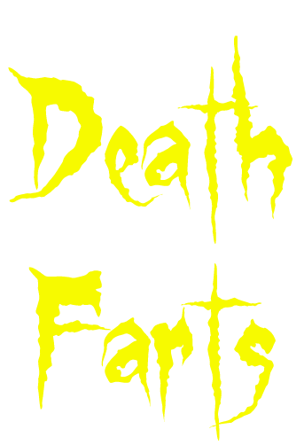
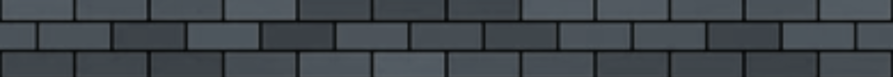
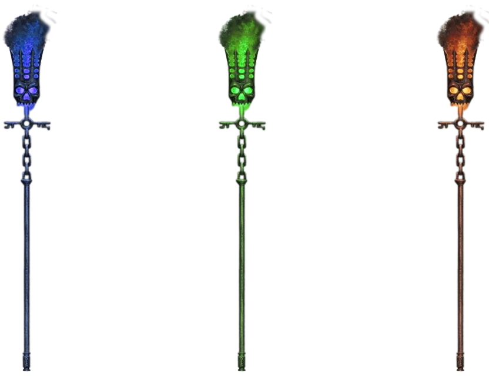
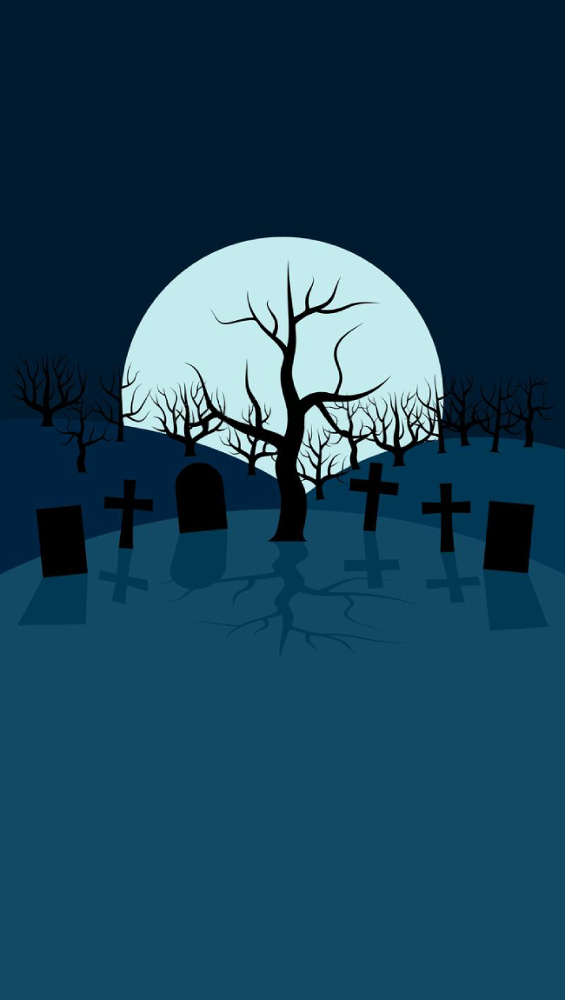
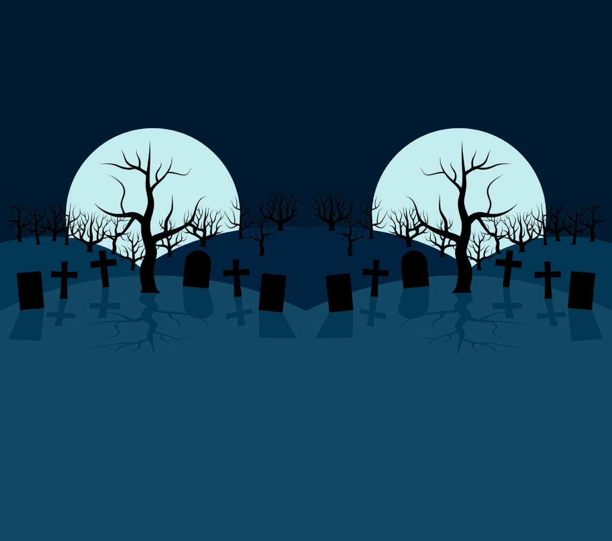
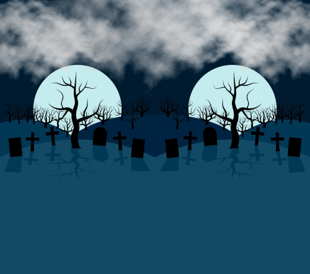
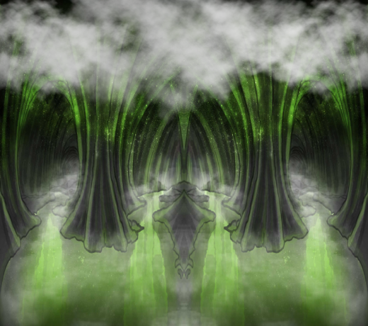
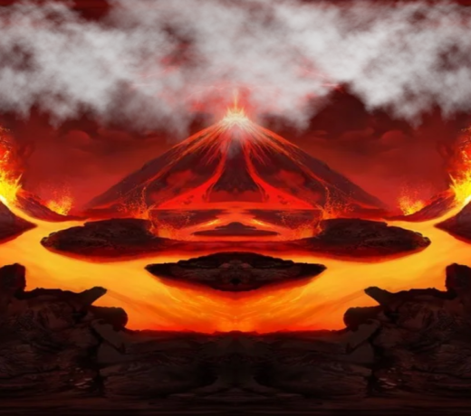
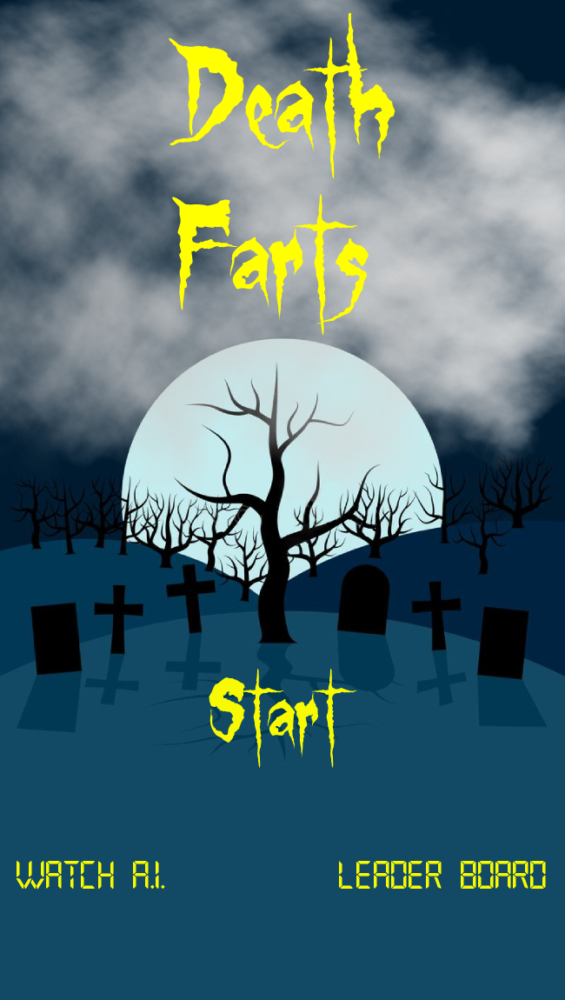
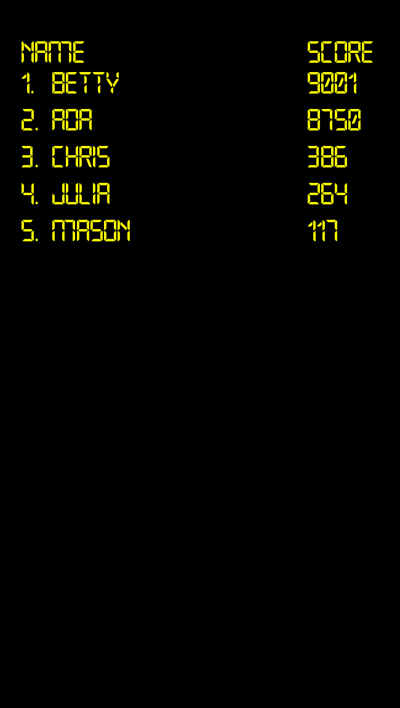

  

 An Utter Masterpiece&trade; By 
Julia Bullard <github.com/Julia-5534> & Mason Counts <github.com/spindouken>

 This Utter Masterpiece&trade; is a loving homage to the late Flappy Bird mobile app game.................. 
But what if instead of Flappy Bird, we played as DEATH RIDING A SCYTHE?!
And what if instead of wings flapping, it was Death's flatulence propelling you forward?!
WHAT IF Death travelled from a Graveyard, through the River Styx, and into the fiery depths of Hell?!?!
WONDER NO MORE! Death Farts is here to quell all those curiosities!

  

## :book: Table of Contents :book:
* [Environment](#environment)
* [Requirements](#requirements)
* [Installation](#installation)
* [IPS](#IPS)
* [Future Functionalities](#future-functionalities)
* [Bugs](#bugs)
* [Authors](#authors)
* [License](#license)

## :computer: Environment :computer:
* This project is interpreted/tested on Ubuntu 20.04 LTS using python3

## :white_check_mark: Requirements :white_check_mark:
* python
* pygame (pip install pygame)

## :cd: Installation :cd:
* Clone the repository: `git clone https://github.com/Julia-5534/DF.git`
* Access the Death Farts directory: `cd DF`
* Run Death Farts: `python3 death_farts.py`
  

## :video_game: Controls :video_game:
* `LMB`
    * Starts Game from Main Menu
* `Tab` or `Alt`
    * Starts Game from Game Over Screen
* `Spacebar`
    * Projects Death into the air
        * Fast taps move Death higher into the air at a faster pace
* `Esc`
    * Stops Gameplay & Directs to Game Over Screen
    * Directs to Main Menu from Game Over Screen
* `Enter`
    * Submits User Name to Leader Board

## :bulb: IPS :bulb:
- What do we use for our obstacles?
    - Lantern Staff in three different colors, one for each of our backgrounds.

  

- How do we implement a seamless side scrolling background?
    - Mirror your image and save it as a separate file.
    - Double the width of your canvas size on your OG image, shift OG image to the left.
    - Place your mirrored image on the right side of the canvas. Voila!

  
  
  

- How can we easily make our three backgrounds blend together better?
    - Add clouds to the top of each background image to help create an illusion of seamless blending

  
  
  

- How do we implement a Leader Board?
    - Use a .txt file for local machine scorekeeping.

  
  

- How do we delay the obstacles in the beginning so you don't immediately crash?
    - Add a function to the gameplay screen
    - Have to tap once on `Spacebar` for the game to start.

- How do we implement the farts?!
    - Use the same image but in three different colors, one for each background.
    - Use pygame.transform.scale() & pygame.Surface
        - Increases the size of the farts while they fade away

  

- Why does the game look like everything's moving weird?
    - The base and lanterns need to move at the same speed. No more motion sickness!

- Why does tapping on the Game Over Screen register on the Main Menu Screen?
    - Need to clear the input buffer
    - Use pygame.event.clear()
        - `LMB` no longer registers on the Game Over Screen

- Why does the fart placement look a little off?
    - Needed to lower the placement of the fart
        - Makes the fart flow look much more natural

  
  
  
  

## :robot: Future Functionalities :robot:
- Super charged fart
- Make intermediate images so the backgrounds fully transition and blend into each other
- Have Death squint when he farts
- Have multiple difficulty levels (perhaps a Fury Mode?)
- Have Death fart & fly by on the Main Menu Screen
- Have the Main Menu Screen scroll into the actual gameplay
- Have Death squint, fart, & fly by on the Game Over Screen

## :beetle: Bugs :beetle:
- No known bugs at this time.

## :memo: Authors :memo:
- Julia Bullard - [Github](https://github.com/Julia-5534)
- Mason Counts - [Github](https://github.com/spindouken) 

## :scroll: License :scroll:
- No touchy! (Insert photo of Llama Cuzco. No, don't. Disney would totally sue.)
